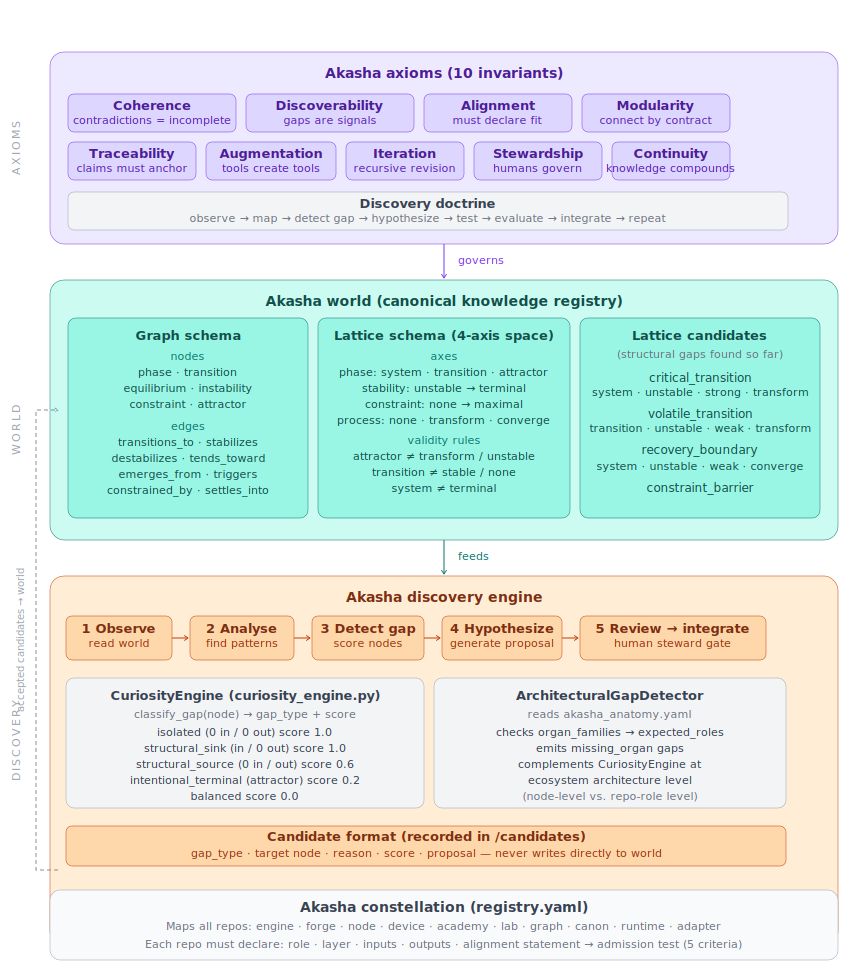

# Akasha Root

The monorepo root for the Akasha constellation — a unified launch point, runtime orchestrator, and working environment for all Akasha engines and tools.

---

## What this is

`akasha_root` is not itself an engine. It is the **ground** everything else stands on.

It wires together the constellation's individual repositories into a single coherent runtime, provides the `./akasha-run` entry point, and owns the live data directories (`events/`, `logs/`, `memory`) that accumulate across every run.

The suite tooling (`akasha-suite/bin/`) lives here as a submodule and is what gives you commands like `akasha-birth`, `akasha-doctor`, `akasha-sync`, and `akasha-coverage-map` on your `$PATH`.

---

## Architecture overview

The diagram below shows how the three structural layers of Akasha — axioms, world, and discovery — relate to each other and to the pipeline stages that `akasha-run` orchestrates.

<!-- akasha_overview.svg — rendered from akasha/akasha-suite/docs/ -->



**Layer 1 — Axioms (`akasha-axioms/`).**
Ten enforceable invariants govern every part of the system: Coherence, Discoverability, Alignment, Modularity, Traceability, Augmentation, Iteration, Stewardship, Continuity, and a Discovery Doctrine. These are not guidelines — violations cause automatic rejection or rollback.

**Layer 2 — World (`akasha-alexandria/`).**
The canonical knowledge registry. Defines the graph schema (nodes: phase, transition, equilibrium, instability, constraint, attractor; edges: transitions_to, stabilizes, destabilizes, tends_toward, emerges_from, triggers, constrained_by, settles_into) and a 4-axis lattice space used to locate structural positions that may correspond to unexplored phenomena.

**Layer 3 — Discovery (pipeline stages 1–7).**
The runtime pipeline. `./akasha-run` feeds your input through seven stages in sequence: ANOMALY → ANALOGY → EDGE → COMBINATOR → ATTRACTOR → PHASE → ATLAS → SUGGESTION. Each stage is a separate engine; the pipeline runs in degraded mode on failure so it never hard-stops mid-run.

---

## Quick start

```bash
# Install Python dependencies (once)
./akasha-core/requirements.sh

# Run the full pipeline
./akasha-run "your input here"
```

Set your location for accurate geo- and time-stamping (ANOMALY stage):

```bash
export AKASHA_LAT=38.5368
export AKASHA_LON=-82.6824
export AKASHA_TZ=America/New_York
```

---

## Pipeline stages

| # | Stage | Engine | Role |
|---|-------|--------|------|
| 1 | ANOMALY | `akasha-anomaly` `cli/pipeline.py` | Stamps input as a time-enriched observation |
| 2 | ANALOGY | `akasha-analogy-engine` `src/main.py` | Structural analogy seeded by input concept |
| 3 | EDGE | `akasha-edge-generator` `src/main.py` | Cross-domain candidate edges (discovery) |
| 3b | COMBINATOR | `akasha-domain-combinator` `src/main.py` | Cross-domain overlap map, tensions, research questions |
| 4 | ATTRACTOR | `akasha-attractor` `cli/pipeline.py` | Event ledger summary (reads `ledger.db`) |
| 5 | PHASE | `akasha-phase-engine` `src/main.py` | Phase state estimation from physics domain |
| 6 | ATLAS | `akasha-atlas-engine` `src/main.py` | Knowledge space map and growth frontiers |
| 7 | SUGGESTION | `akasha-suggestion-engine` `src/main.py` | Ranked next-step suggestions (open items only) |

---

## Runtime data

All persistent state lives under `akasha-core/`:

```
akasha-core/
  events/
    ledger.db              # SQLite ledger — ATTRACTOR reads this
    <uuid>.json            # JSON sidecar written per event by ANOMALY
  logs/
    run_<YYYYMMDD_HHMMSS>.log   # Full output of every run
  memory.ndjson            # One record per run: ts + input
```

The pipeline never modifies `akasha/` source directories at runtime. All output flows into `akasha-core/`.

---

## Environment variables

| Variable | Default | Purpose |
|----------|---------|---------|
| `AKASHA_LAT` | `0.0` | Latitude for ANOMALY geo-stamping |
| `AKASHA_LON` | `0.0` | Longitude for ANOMALY geo-stamping |
| `AKASHA_TZ` | `UTC` | Timezone for ANOMALY clock context |

---

## Suite tools

After installing via `akasha-suite/install.sh`, the following commands are available:

| Command | Purpose |
|---------|---------|
| `akasha-run` | Run the full discovery pipeline |
| `akasha-birth <name>` | Scaffold a new constellation repo with manifest, gitignore guard, and git init |
| `akasha-doctor [--sync]` | Health-check all repos: branch, remote, manifest, archetypes, working tree state |
| `akasha-sync` | Pull all repos and trigger mythology engine if supported |
| `akasha-canon` | Enforce canonical structure across repos |
| `akasha-coverage-map` | Generate `ARCHETYPE_COVERAGE_MAP.md` — which structural archetypes each repo covers |
| `akasha-seed-archetypes` | Seed archetype request files from downloaded zip bundles |
| `akasha-log` | Display run logs |
| `akasha-status` | Print constellation status summary |
| `akasha-map` | Print repo map |
| `akasha-phase` | Query phase state |
| `akasha-brainstorm` | Brainstorm mode |
| `akasha-capture` | Capture an observation |
| `akasha-clean` | Clean generated artifacts |
| `akasha-remotes` | List and check git remotes |
| `akasha-console` | Interactive console |
| `akasha-populate` | Populate a repo from a template |
| `akasha-menu` | Interactive menu |

---

## Repo layout

```
akasha_root/
  akasha-run                    # Entry point → delegates to akasha-core/orchestrator.sh
  akasha-core/                  # Live runtime data (events, logs, memory)
  akasha/
    akasha-suite/               # Coordination tooling and bin/ scripts
    akasha-axioms/              # Ten enforceable invariants + discovery doctrine
    akasha-alexandria/          # Canonical knowledge schema and registry
    akasha-time-nexus/          # Time enrichment (solar, lunar, weather, clock)
    akasha-rcf/                 # Request/candidate format definitions
    build_outputs/              # Build artifacts and plans
  .githooks/
    pre-commit                  # Constellation gitignore guard
```

---

## Invariants

The ten invariants defined in `akasha-axioms/INVARIANTS.md` apply to everything in this repo:

1. **Structural Integrity** — all entities conform to schema; all references resolve; all IDs are unique and stable.
2. **Consistency** — no mutually exclusive properties; no contradicting relations; canon remains logically satisfiable.
3. **Completeness Signals** — symmetry groups should be closed; orphan nodes tracked.
4. **Provenance** — every entity must carry source, timestamp, and lineage.
5. **Immutability of Canon History** — append-only; edits create new versions; deletion forbidden, only deprecation.
6. **Determinism** — same input + same world state → identical output.
7. **Auditability** — every change produces a human- and machine-readable diff.
8. **Safety Boundary** — experimental artifacts never enter canon; `/world` vs `/candidates` separation is enforced.
9. **Regression Protection** — no accepted change may break existing invariants.
10. **Minimality** — new additions must solve a specific gap; redundant entities are rejected.

---

## Python dependencies

```bash
pip install -e akasha/akasha-time-nexus
pip install -e akasha/akasha-anomaly
pip install -e akasha/akasha-attractor
pip install -e akasha/akasha-apis
pip install PyYAML
```

Or run `./akasha-core/requirements.sh` which does all of the above.

---

## Support the project

Akasha is an independent open research effort.

☕ [Buy Me a Coffee](https://buymeacoffee.com/Thegreatoleander)

ETH / EVM: `0x185325DB018e6ECBb92Bf0443ABFBbB3a07cE713`

---

## License

Open research license while the framework is under active development. Commercial licensing may be introduced in future versions. See `LICENSE` for full terms.
