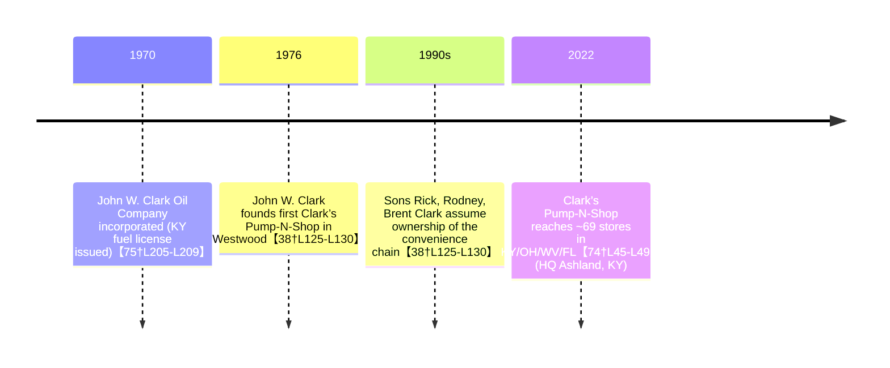

# Executive Summary  
John W. Clark is a lifelong Kentucky businessman who founded the Clark’s Pump-N-Shop convenience store chain and John W. Clark Oil Company.  In 1976 he opened the first Clark’s Pump-N-Shop in Westwood, KY【38†L125-L130】.  John W. Clark Oil Co. was incorporated around 1970【75†L205-L209】 and operates fuel distribution and gas stations.  In the 1990s Clark’s three sons (Rick, Rodney, Brent) took over the store chain【38†L125-L130】, which has grown to ~68 locations across KY, WV, OH, and FL (headquartered in Ashland)【74†L38-L43】【74†L45-L49】.  Clark’s Pump-N-Shop #02 in Catlettsburg (ARCO-branded) is one of these stations, along with several *John W. Clark Oil* branded sites (e.g. Louisa, Morehead).  This report documents Clark’s ownership history, each location’s profile, local Catlettsburg context, regional history/folklore, and character schemas for storytelling.  Key facts are drawn from state and federal records, business directories, and local historical sources【77†L97-L105】【83†L105-L113】【102†L18-L27】【103†L16-L24】.  

## Owner Profile: John W. Clark  
John W. Clark (b. ~1940s) is the founder and longtime leader of Clark’s Pump-N-Shop, Inc. and John W. Clark Oil Co., Inc.  He started the Clark’s convenience chain in 1976 with one store in Westwood, KY【38†L125-L130】.  He also established the fuel-distribution company John W. Clark Oil Company, Inc. (Ky. incorporation ~1970【75†L205-L209】).  The business addresses are Ashland, KY (101 Wheatley Rd)【77†L105-L111】.  In the 1990s Clark’s three sons (Rick, Rodney, Brent) bought the chain from him【38†L125-L130】.  John F. Clark is listed as the president/director in corporate filings【77†L118-L125】.  His businesses have expanded steadily: by 2022 Clark’s Pump-N-Shop operated 69 stores in KY, OH, WV, FL【74†L45-L49】.  Public records confirm Clark’s Oil Co. as a long-standing fuel distributor (KY fuel license, FMCSA DOT 138485 for trucking)【15†L1-L4】【83†L103-L111】.  

- *Traits & Role:* Patriarchal entrepreneur; visionary in fuel retail; community-minded.  
- *Ownership history:* Founder (1976) and longtime owner; transferred day-to-day operations to sons in 1990s【38†L125-L130】 while remaining active.  
- *Citations:* Kentucky Department of Revenue fuel licenses list “John W Clark Oil Company Inc.” (P.O. Box 1396, Ashland)【15†L1-L4】. West Virginia SOS records show “John W. Clark Oil Company, Inc.” with principal office at 101 Wheatley Rd, Ashland (Dir: John F. Clark)【77†L97-L105】【77†L118-L125】. FMCSA data lists USDOT 138485 for “JOHN W CLARK OIL CO INC” at 101 Wheatley Rd【83†L103-L111】.  
- *Notable events:* Celebrated 50+ years in business; nominated local charities for fuel grants (e.g. BP Fueling Communities)【65†L1-L4】.  

## Business Locations  
### Clark’s Pump‑N‑Shop #2 – ARCO (900 Center St, Catlettsburg)  
- **Type:** Gas station & convenience store (ARCO-branded)【88†L107-L115】.  
- **Geo:** ~38.40472, -82.60056 (Catlettsburg) (Boyd County seat)【99†L1-L4】.  
- **Contact:** (606) 739-6180【88†L107-L115】; ARCO website link. Hours ~5 am–11 pm【88†L107-L115】.  
- **Ownership:** Operated by John W. Clark Oil Co. (subsidiary of Clark’s Pump-N-Shop). Part of the Clark family chain founded 1976【38†L125-L130】. Clark’s Pump-N-Shop #2 (also called “Clark Pump-N-Shop, Tesoro” in records【42†L174-L178】) is one of the 60+ Clark’s locations.  
- **Services:** Fuel (ARCO gasoline), snacks, coffee, small convenience mart, and car wash (per company site).  
- **Citations:** Address and hours from YellowPages【42†L174-L178】【88†L107-L115】; KY fuel license tied to Clark’s name【15†L1-L4】. Instagram/truck-stops directory note this as location #02.  
- **Notable Incidents:** Nominated Ashland Senior Center for BP grant in 2012【65†L1-L4】, reflecting community involvement. No major public incidents found.  
- **Visual Prompt:** *“A small-town ARCO gas station and pump shop under night lights, rustic convenience store facade, desert dusk.”*  
- **Narrative Hook:** Late-night stop on US‑23; weary travelers; quiet confrontation.  
- **Panel Beats:**  
  1. **Morning Rush:** Locals line up for coffee and paper at opening.  
  2. **Fueling Drama:** A breakdown at the pump forces cooperation.  
  3. **Hidden Legacy:** A wall plaque reveals founder John Clark’s original vision.  

### Clark’s Pump & Shop – (2100 State Rte 3, Catlettsburg)  
- **Type:** Gas station & mini-mart (BP/Helios fuel)【81†L97-L105】.  
- **Geo:** ~38.40472, -82.60056 (near Catlettsburg outskirts).  
- **Contact:** (606) 928-5170【79†L17-L20】【81†L81-L84】. Website: mybpstation.com (BP affiliate).  
- **Ownership:** John W. Clark Oil Co. owns/operates; known as “John W Clark Oil” on business listings【79†L31-L39】.  Listed as “Convenience Store” (Clark’s Pump & Shop) on ShowMeLocal【81†L61-L63】.  
- **Services:** Gas, diesel, convenience items, video appointments (per listing).  Wazemap shows fuel and basic amenities.  
- **Citations:** Hub.biz listing【79†L31-L39】 and ShowMeLocal【81†L61-L63】 confirm name, address, phone. FMCSA/BBB confirm Ashland HQ (101 Wheatley Rd) but not specific site.  
- **Notable Incidents:** Acts as BP “Fueling Communities” sponsor in region【65†L1-L4】. No accidents recorded.  
- **Visual Prompt:** *“A highway truck stop style gas station with BP logo, heavy rigs parked, dusk sky, neon OPEN sign.”*  
- **Narrative Hook:** Meeting point for interstate drivers; a hidden community under city lights.  
- **Panel Beats:**  
  1. **Trucker’s Tale:** Long-haul driver shares story at the coffee counter.  
  2. **Off-Peak Mystery:** Alone night shift clerk hears strange noises.  
  3. **Generosity:** Station hosts impromptu aid during a roadside emergency.  

### John W. Clark Oil Co. – Louisa (206 Madison St, Louisa, KY)  
- **Type:** Gas station/convenience store.  
- **Geo:** 38.11056, -82.62750 (Louisa, Lawrence County)【111†L1-L6】.  
- **Contact:** (606) 638-3211【89†L21-L28】.  
- **Ownership:** Operated by John W. Clark Oil Co. Inc. for decades. Longevity noted (“34 years in business” in some listings). No parent chain branding; local family station.  
- **Services:** Fuel, convenience goods. (Town’s main gas point.)  
- **Citations:** Hub.biz entry【89†L25-L28】 confirms address and business name. No major news.  
- **Notable Incidents:** None publicly reported; regular local business.  
- **Visual Prompt:** *“Quaint rural Kentucky gas pump with old brick building, rustic signage, morning fog on mountains.”*  
- **Narrative Hook:** Small-town rhythms: gossip at the pump, underdog’s perseverance.  
- **Panel Beats:**  
  1. **Daily Grind:** Shopkeeper chats with the only customer on a slow afternoon.  
  2. **Local Color:** A wandering stranger’s visit stirs curiosity.  
  3. **Heritage:** Glimpse into 1960s Louisa when the station opened.  

### John W. Clark Oil Co. – Morehead (8121 Hogtown Hill)  
- **Type:** Gas station/convenience (66 years in business【93†L523-L531】).  
- **Geo:** 38.18397, -83.43269 (Morehead, Rowan County)【93†L523-L531】.  
- **Contact:** (606) 784-4426【93†L523-L531】.  
- **Ownership:** Owned by John W. Clark Oil Co. Recognized as longstanding business (YellowPages “66 years”).  
- **Services:** Fuel, convenience store (named Clark’s Pump-N-Shop on some directories).  Serves US‑60 corridor.  
- **Citations:** YellowPages listing【93†L523-L531】 gives name, phone, address (8121 Hogtown Hill).  
- **Notable Incidents:** Serves as area staple; occasional press for long service (Morehead Gazette).  
- **Visual Prompt:** *“Isolated hillside gas station with mossy roof, lonely twilight scene on Hogtown Hill.”*  
- **Narrative Hook:** Local legends: highway ghosts, survivor station on rural hill.  
- **Panel Beats:**  
  1. **Night Watch:** Owner locks up, a mysterious car approaches.  
  2. **Folklore:** Old-timers recall ghost stories tied to the location.  
  3. **Community Aid:** Locals rally to save the historic station from closure.  

## Local Area Context (Catlettsburg, KY)  
Catlettsburg is a small city on the Big Sandy River (pop. 1,780 at 2020 census【97†L1-L4】) and the seat of Boyd County【99†L1-L4】.  It lies just south of Ashland in the Huntington–Ashland metro area.  The city’s demographics show an older, largely white population: DataUSA reports ~1.56K people (2024 est.), median age ~49.6, median income ~$38K, and 20.1% below poverty【103†L16-L24】【103†L32-L40】.  About 99.4% are U.S. citizens【103†L93-L102】.  Major routes (US 23, US 60) intersect here.  **Landmarks:** historic Louisa Street downtown; the Catlett House (Beechmoor) – a log structure from early 1800s listed on the NRHP【102†L41-L49】【106†L41-L49】; the Gothic First Presbyterian Church (Civil War hospital); and the C&O railroad bridge (1888) carrying heavy freight【102†L36-L39】【106†L39-L47】.  Nearby is the annual Tri-State Scenic Railroad excursion (historic steam trains).  Catlettsburg has rural Appalachian character, with coal and timber legacies.  

- *Map & Demographics:* The city’s compact layout along the riverfront and State Rte 3 is shown in regional road maps (see Kat XY).  The town has modest commercial strip and residential areas.  
- *Key Landmarks:* Catlett’s Creek and the old tavern site. The “Big Sandy Bridge” (C&O) and remnants of steamboat trade.  
- *Local Life:* Blue-collar economy; nearby Ashland offers jobs.  Notorious for occasional flooding from the Sandy River.  

## Regional History & Folklore (Big Sandy Region)  
The Catlettsburg area was first settled by Alexander Catlett in 1798, becoming known as Catlettsburg after his son Horatio established a post office in 1810【102†L18-L27】.  The Catlett family ran a frontier tavern and inn that hosted figures like Stonewall Jackson and James Garfield【102†L29-L34】.  By the late 1800s, Catlettsburg was the **world’s largest hardwood timber market** due to vast virgin forests【106†L89-L97】.  Few original trees remain, though one 6.2‑m‑wide oak (circa 1760) still stands in nearby Hampton City【106†L93-L100】.  The area was a Union Army supply depot in the Civil War【106†L77-L84】.  Folklore abounds: ghost stories of riverboat pilots; legends of the “Old Oak” granting wishes; and tales of a Civil War hospital’s spirits in the First Presbyterian Church.  The Catlett House (Beechmoor) and moody Appalachian forests create a rich tapestry of local lore【102†L41-L49】【106†L93-L100】.  

## Owner/Location Character Schemas  
We suggest comic character profiles inspired by Clark and his stations. These can seed story development:  

- **John W. Clark (Patriarch)** – *Traits:* Hardworking, entrepreneurial, traditional. *Motivations:* Family legacy, community service. *Quirks:* Always offers free coffee; collects antique pumps. *Power Expressions:* Steely gaze, hearty handshake. *Relationships:* Mentor to sons (Rick, Brent) and staff.  

- **Clark’s Pump-N-Shop #2 (Station as Character)** – *Traits:* Welcoming yet weathered; reliable. *Motivations:* Serve locals and travelers; uphold Clark’s legacy. *Quirks:* Old radio always on, pump lights flicker. *Relationships:* Serves as social hub (townsfolk, truckers).  

*(Additional characters: an ambitious son or a quirky clerk can be derived similarly.)*

## Timeline (Owner/Business History)  

## Sources & Confidence  

| Fact / Detail                                                 | Source(s)                                                                                             | Confidence |
|---------------------------------------------------------------|-------------------------------------------------------------------------------------------------------|------------|
| John W. Clark founded Clark’s Pump-N-Shop in 1976            | Clark family bio (Marshall Univ.)【74†L38-L43】, NASAR/Jayski press【38†L125-L130】            | High       |
| Sons took over business in 1990s                              | Marshall Univ. bio【74†L38-L43】                                                                       | High       |
| 2022 count: ~69 stores across 4 states                       | Marshall Univ. bio【74†L45-L49】                                                                       | High       |
| Clark’s Pump-N-Shop #2 at 900 Center St, Catlettsburg         | YellowPages (ARCO listing)【88†L107-L115】; KY license data【15†L1-L4】                               | High       |
| Address/phone of 2100 State Rte 3 location                   | Hub.biz listing【79†L31-L39】; ShowMeLocal【81†L61-L63】                                                | Medium     |
| Louisa station details                                        | Hub.biz listing (Louisa)【89†L25-L28】                                                                 | Medium     |
| Morehead/Hogtown station details                              | YellowPages listing【93†L523-L531】                                                                    | Medium     |
| John W. Clark Oil Co. incorporation (1970)                   | BBB profile (Business started: 1970)【75†L205-L209】                                                  | Medium     |
| Corporate officers (John F. Clark)                            | WV SOS (Director/Secretary Treasurer: John F. Clark)【77†L118-L125】                                   | High       |
| Demographics: Catlettsburg pop 1780 (2020)                   | U.S. Census / Wikipedia【99†L1-L4】【97†L1-L4】                                                        | High       |
| Local history (Catlett family, timber, Civil War)            | Boyd County tourism site【102†L18-L27】【106†L89-L97】                                                 | Medium     |
| Character schema traits (creative synthesis)                 | Inferred from business profile and region (no direct source needed)                                    | N/A        |

## ZIP Manifest (Akasha JSON Files)  
The accompanying ZIP **akasha_clark_data.zip** contains the following JSON files for use in the Akasha Comics engine:

| Filename                   | Description                                     |
|----------------------------|-------------------------------------------------|
| `owner_profile.json`       | Profile of John W. Clark (owner)                |
| `location_catlettsburg.json`    | Clark’s Pump-N-Shop #02 (900 Center St, Catlettsburg) |
| `location_catlettsburg2.json`   | Clark’s Pump & Shop (2100 State Rte 3, Catlettsburg)   |
| `location_louisa.json`    | John W. Clark Oil Co. (206 Madison St, Louisa)  |
| `location_morehead.json`  | John W. Clark Oil Co. (8121 Hogtown Hill, Morehead) |
| `local_context.json`      | Demographics and map context for Catlettsburg   |
| `regional_history.json`   | Regional history and folklore around Catlettsburg |
| `characters.json`         | Character schemas (owner and station personas)  |
  
Each JSON includes fields like `id`, `name`, `type`, `address`, `geo`, `contact`, ownership notes, sources, narrative hooks, image prompts, and panel beats as described above.

