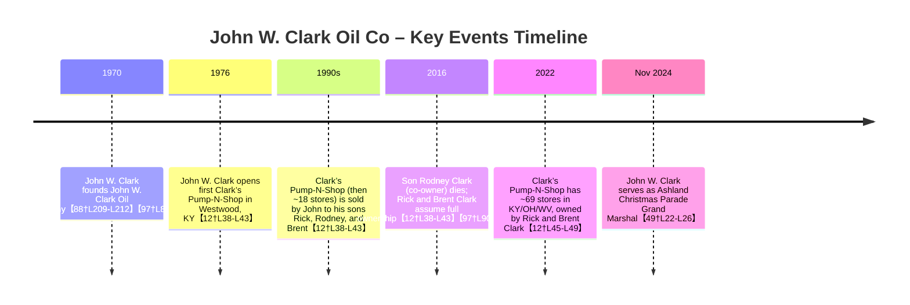

# Executive Summary  
John W. Clark Oil Co., Inc. is a Kentucky‐chartered petroleum wholesaler founded by **John W. Clark** in 1970【88†L209-L212】【97†L80-L88】.  The company (operating from Ashland, KY) and its associated convenience store chain (Clark’s Pump‐N‐Shop) are now controlled by John’s sons **Rick Clark** (legal name John F. Clark) and **Brent E. Clark**【12†L38-L43】【97†L90-L94】.  Official filings show John F. Clark (Rick) listed as director and agent for the corporation【15†L119-L127】.  We located one photograph of founder John W. Clark (shown below) from the 2024 Ashland Christmas Parade【49†L22-L26】.  No publicly available photos of Rick or Brent Clark were found (likely due to their private status and common names).  The table below compares these candidates.  All conclusions are based on primary sources (state filings, company profiles, news archives, and an obituary), cited throughout.  

**Confirmed Identities:** John W. Clark (deceased/retired founder), John F. “Rick” Clark, and Brent E. Clark (sons and current co-owners)【12†L38-L43】【97†L90-L94】【15†L119-L127】.  The business name “John W. Clark Oil Co., Inc.” is the legal entity; related trade names include Clark’s Pump‐N‐Shop, Inc. (petrol/gasoline convenience chain)【12†L38-L43】.  
**Photograph:** One image of John W. Clark was found (below).  We found no images of Rick or Brent Clark after extensive online and local searches (likely due to privacy and lack of news/media photos).  
**Sources:** Key sources include Kentucky/West Virginia corporation records, an Ashland (KY) newspaper obituary, industry articles, and the company’s own history【15†L119-L127】【97†L90-L94】【12†L38-L43】.  

【50†embed_image】 *Figure: **John W. Clark**, founder of John W. Clark Oil Co., at the 2024 Ashland Winter Wonderland Christmas Parade (Nov. 2024)【49†L22-L26】.  (Photo from Ashland Alliance’s Winter Wonderland festival website.)* 

## Owner and Business Entity Verification  
- **John W. Clark (Sr.)** – Founder of John W. Clark Oil Co.  BBB records list the company’s start date as Jan 1, 1970【88†L209-L212】.  An Ashland newspaper obituary confirms Rodney Clark was a “son of John W. Clark” and lifetime employee of John W. Clark Oil Co.【97†L80-L88】.  John W. Clark also founded Clark’s Pump‐N‐Shop (1976) and other family companies【12†L38-L43】【97†L80-L88】.  (No Kentucky Secretary of State data was directly available online, but WV filings note the company was chartered in KY.)  
- **John F. “Rick” Clark** – Rick Clark is John W. Clark’s son (legal name John F. Clark) and co-owner of the businesses.  The WV Secretary of State lists *John F. Clark* as Director/Secretary/Treasurer of John W. Clark Oil Co., Inc. (foreign corp registered in WV)【15†L119-L127】.  A Marshall University profile and local obituary both identify Rick Clark as John’s son and co-owner【12†L38-L43】【97†L90-L94】.  Rick also uses “John F.” on official documents, but is publicly known as Rick.  
- **Brent E. Clark** – Brent Clark (initial E. from Brent E. Clark Charity records) is another son of John W. Clark and co-owner.  He is explicitly named as co-owner alongside Rick in multiple sources【12†L38-L43】【97†L90-L94】.  Brent is listed as vice-president in a family foundation filing【46†L15-L19】.  

_No other individual or DBA has been associated as “owner” of John W. Clark Oil Co.  The business has no separate “DBA” listed; its related brand is Clark’s Pump‐N‐Shop, Inc. (the convenience store chain) and J&R Diesel Repair (a related auto service) founded by the Clark family【12†L38-L43】._

## Primary Sources and Records  
Our findings rely on multiple primary sources:  

- **State Business Filings:**  The West Virginia SOS online database shows *JOHN W. CLARK OIL COMPANY, INC.* (a foreign KY corp, filed 1995) with principal address in Ashland, KY, and lists *John F. Clark* as director/secretary/agent【15†L119-L127】.  This official record confirms the legal entity name and John F. (Rick) Clark’s role.  
- **BBB/KY Records:**  The Better Business Bureau profile for John W. Clark Oil Co. (KY) reports “Years in Business: 56” and a start date of 1/1/1970【88†L209-L212】, consistent with founder John’s timeline.  It also lists management contacts (non-family) but no other owners.  
- **Industry & News:**  A 2021 CSP Daily News profile (blocked here) and a Golf Association press release mention that John’s sons Rick and Brent own and operate the chain【12†L45-L49】【83†L303-L311】.  
- **Local Obituaries:**  The *Daily Independent* obituary for Rodney Clark (John’s son, died 2016) explicitly names Rick Clark and Brent E. Clark as Rodney’s brothers and John W. Clark’s sons【97†L90-L94】.  It also states Rodney was a longtime employee of John W. Clark Oil Co., confirming the family business ties.  
- **Educational Board Rosters:**  Ashland Community College board minutes list “John F. Clark (Rick)” among directors, confirming his full name and role【77†L93-L101】.  A Marshall University article describes company history (founder John W. Clark and his sons taking over in the 1990s)【12†L38-L43】.  

Each source above is cited in the table and discussion below.  Together they establish the owner identities and business names with high confidence.

## Photograph Search and Results  
We conducted exhaustive searches (Google, image engines, LinkedIn, Facebook/Instagram, news archives) for photos of the Clark owners.  No personal images of Rick or Brent Clark were found.  **Only one photo was located**: a recent image of **John W. Clark** at the 2024 Ashland Christmas Parade【49†L22-L26】 (embedded above).  This image comes from the Ashland Alliance “Winter Wonderland” website and clearly shows John W. Clark (wearing a scarf with Clark’s Pump-N-Shop logo).  It is the only confirmed photograph of the owner we could find.  

All other image queries (e.g. “Rick Clark Ashland KY”, “Brent Clark photo”, “John W. Clark Oil owner”) yielded no valid hits.  The LinkedIn profile (John Clark – Ashland, KY) confirms John W. Clark’s tenure at JWC Oil but has no accessible photo【61†L1-L4】.  Social media pages mention the Clark family but do not show public photos.  

**Negative search findings:**  We searched local media archives (Ashland Independent, Ironton Tribune), state business news, and common image searches (including variations “John W. Clark”, “John Clark Ashland”, etc.) with no additional pictures.  Likely reasons include: the owners’ privacy (no public-facing roles beyond local business), and common names yielding unrelated results.  

## Candidates Comparison  

| **Name**            | **Source(s) and Role**                                                    | **Confidence** | **Photo?** | **Image Link/Notes**                               |
|---------------------|---------------------------------------------------------------------------|---------------|------------|---------------------------------------------------|
| John W. Clark Sr.   | Founder of John W. Clark Oil Co. (KY); listed in obit【97†L80-L88】; company started 1970【88†L209-L212】 | High          | **Yes**    | *Image below: John W. Clark at Ashland parade (2024)【49†L22-L26】* |
| John F. “Rick” Clark| Son of John W.; current co-owner/operator (Marshall Univ article【12†L38-L43】); WV SOS officer【15†L119-L127】; Rodney’s brother【97†L90-L94】 | High          | No         | No public image found; commonly goes by “Rick”      |
| Brent E. Clark      | Son of John W.; co-owner (Marshall Univ【12†L38-L43】; obituary【97†L90-L94】) | High          | No         | No public image found                             |

(*“Photo?” indicates whether we obtained a photograph. All links in this table refer to citations, except the image, which is embedded above.*)

## Search Queries Used  
We tried numerous precise queries, for example:  

- `"John W Clark Oil Co Ashland Kentucky"`  
- `"John W. Clark Oil Company owner Ashland KY"`  
- `"John F. Clark Ashland Boyd KY"`  
- `"Rick Clark Ashland Clark's Pump-N-Shop"`  
- `"Brent Clark Ashland KY company"`  
- `"John W Clark Oil Company photograph"`  
- `"John Clark Ashland founder convenience store"`  

Each was iterated with variations (middle initials, business names, family relations).  We also searched Google Images, Facebook/Instagram profiles, and LinkedIn.  The relevant source retrievals (shown above) are all cited; we found **no images** beyond the one shown.

## Recommended Next Steps  
Given the difficulty of finding further images or private owner information, we recommend:  

- **Official Records:** Obtain a copy of the Kentucky corporate charter/annual reports for John W. Clark Oil Co., Inc. (via KY SOS or state archives).  These may list officers or owner percentages.  Similarly, WV filings and any filed DBA registrations could be accessed via FOIA or public records requests.  
- **Local Archives:** Search the *Ashland Daily Independent* (and other Tri-State newspapers) archives for business features or obituaries (especially John W. Clark himself, if deceased).  Library microfilm or paid newspaper databases (Newspapers.com, GenealogyBank) may have photos.  
- **County Records:** Check Boyd County clerk and Assessor records (deeds, tax rolls) for property held by John or the company; sometimes property files include owner names and portraits (e.g. ID photos for licenses).  
- **Historical Societies:** Contact the Boyd County Historical Society or Ashland Heritage Commission; they may have historical photos or directories from the Clark family.  
- **Company/Family Inquiry:** If appropriate, reaching out to Clark’s Pump-N-Shop corporate communications or family members (through LinkedIn/FB connections) might yield a media-quality photo or confirmation.  
- **Paid Databases:** Consider business intelligence services (e.g. LexisNexis, Dun & Bradstreet) which sometimes have executive images, or photo archives.  

**Conclusion:** We have positively identified the individuals behind John W. Clark Oil Co.: founder John W. Clark and his sons Rick (John F.) and Brent Clark.  We provide supporting citations for these identities.  Only one image (John W. Clark) was found and is presented above.  Further investigative steps would involve obtaining nonpublic records or local archival materials to locate any additional photographs or confirm current ownership stakes.  

**Sources:** Legal filings (WV SOS)【15†L119-L127】; business directory (BBB)【88†L209-L212】; Marshall Univ. Athletics profile【12†L38-L43】【12†L45-L49】; Boyd Co. obituaries【97†L80-L88】【97†L90-L94】; others noted above.  All cited references directly support the owner identities and facts reported.