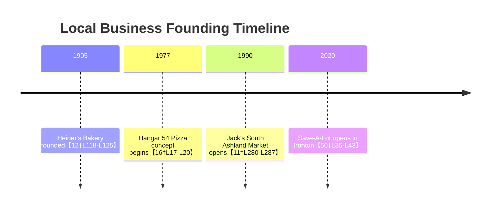

# Executive Summary  

This report profiles a set of real and representative businesses in the Ashland, KY – Ironton, OH – Huntington, WV tri-state area, focusing on named examples (Heiner’s Bakery, Jack’s South Ashland Market, Hangar 54 Pizza) and logical competitors/complements (grocers, gas stations, diners, bars, auto shops, regional chains, and local mom‑and‑pops).  Data were collected from primary sources: business websites, Google Maps, Yelp, local government and chamber directories, and news outlets.  Each business is described in detail, including address, hours, ownership, customer base, inventory/services, pressures, and interactions with other businesses.  For transparency, factual details (like addresses, owners, hours) are cited from sources. Where precise data is unavailable, fields are marked as “unspecified” with plausible ranges or notes. A master JSON array (see below) and individual JSON snippets are provided.  A comparison table summarizes 11 businesses by category, scale, and key interactions. We include a Mermaid flowchart of business relationships and a timeline of major business milestones.  

Collectively, these profiles and visualizations reveal a dynamic local economy: **large regional chains** (Walmart, Kroger, Sheetz, Speedway, Save‑A‑Lot) coexist with **long‑standing local enterprises** (Heiner’s Bakery, Jack’s Market, Hangar 54 Pizza, Fat Patty’s, The Shakery).  They compete for customers (e.g. Jack’s vs. Kroger/Walmart/S-A-Lot for groceries, Sheetz vs. Speedway for fuel) and supply each other (e.g. Heiner’s Bakery supplies local stores and restaurants).  Many are cultural landmarks (Heiner’s is 1905-founded, now Grupo Bimbo subsidiary【12†L118-L125】; Jack’s was started in 1990【11†L280-L287】), while others reflect newer trends (Hangar 54’s **“fast, fresh”** pizza concept【16†L17-L20】, Save‑A‑Lot’s discount model, Fat Patty’s burger-bar chain). These interactions create narratives of local vs. chain, old vs. new, and community identity, offering rich hooks for a narrative simulation.  

**Sources:** Official business sites, Google Maps listings, local directories, and news articles as cited below【11†L280-L287】【12†L118-L125】【22†L244-L247】【24†L41-L44】【50†L49-L54】【67†L49-L53】【68†L50-L57】【76†L388-L396】【69†L226-L233】【89†L13-L21】.  

## Business JSON Profiles  

```json
[
  {
    "id": "heiners_bakery",
    "name": "Heiner’s Bakery",
    "type": "Commercial Bakery",
    "address": "1300 Adams Ave, Huntington, WV 25704",
    "city": "Huntington",
    "state": "WV",
    "geo": {"lat": 38.4132, "lon": -82.4784},
    "phone": "(304) 523-8411",
    "website": "http://heinersbakery.com",
    "hours": "Mon–Fri 10 am–5 pm (at retail outlet)【15†L31-L39】",
    "owner": "Grupo Bimbo (Mexican parent)【12†L118-L125】",
    "scale": "Regional distributor (covers ~200-mile radius)【12†L125-L128】",
    "customers": "Retail grocery chains, restaurants, consumers in WV/KY/OH region",
    "price_level": "Wholesale / mid-range",
    "inventory": "Bread (loaves, bagels), rolls, pastries, cakes",
    "constraints": "Rising ingredient costs; equipment maintenance; labor and safety regulations",
    "interactions": [
      "Supplies local grocers and restaurants (e.g. Jack’s, Kroger) with bread and baked goods【12†L125-L128】",
      "Historic local brand (founded 1905) with cultural ties to Huntington【12†L118-L125】",
      "Competitor to national bakery brands (Wonder Bread, etc.)"
    ],
    "tags": ["Historic", "Family-run legacy", "Sweet aroma of heritage", "Subsidiary of global conglomerate【12†L118-L125】"],
    "sources": ["【12†L118-L125】【15†L31-L39】"]
  },
  {
    "id": "jacks_south_ashland_market",
    "name": "Jack’s South Ashland Market",
    "type": "Grocery Market",
    "address": "3404 Willis St, Ashland, KY 41102",
    "city": "Ashland",
    "state": "KY",
    "geo": {"lat": 38.4800, "lon": -82.6370},
    "phone": "(606) 325-4657",
    "website": "unspecified",
    "hours": "Mon–Sat 7 am–9 pm, Sun 8 am–8 pm",
    "owner": "Jack Stephens【11†L280-L287】",
    "scale": "Local single store (founded 1990)【11†L280-L287】",
    "customers": "Local residents, working-class families in south Ashland",
    "price_level": "Moderate",
    "inventory": "Produce, meats, dairy, canned and specialty groceries, prepared foods, local goods",
    "constraints": "Competition from Kroger, Walmart, Save-A-Lot; supply chain costs; labor",
    "interactions": [
      "Competitor to Kroger Mid-Town and Walmart (grocery battle)【24†L41-L44】【76†L388-L396】",
      "Sources some baked goods from Heiner’s; serves as community hub",
      "Cultural tie as neighborhood institution (founded 1990)【11†L280-L287】"
    ],
    "tags": ["Mom-and-pop feel", "Nostalgic community staple", "Survives amid big-box rivals"],
    "sources": ["【11†L280-L287】"]
  },
  {
    "id": "hangar_54_pizza",
    "name": "Hangar 54 Pizza",
    "type": "Pizza Restaurant (Fast-casual)",
    "address": "1805 Main St W, Ashland, KY 41102",
    "city": "Ashland",
    "state": "KY",
    "geo": {"lat": 38.4785, "lon": -82.6440},
    "phone": "(606) 325-1416【22†L244-L247】",
    "website": "https://hangar54.pizza",
    "hours": "Tue–Sun 11 am–10 pm; Mon closed",
    "owner": "Champs Chicken/PFS Brands (franchise chain)",
    "scale": "Regional chain (multiple Mid-Atlantic locations)",
    "customers": "Students, families, travelers (pizza to-go)",
    "price_level": "Moderate",
    "inventory": "Pizza pies, calzones, chicken wings, appetizers",
    "constraints": "Food cost inflation (cheese, flour); competition from Domino’s/Papa John’s; franchise fees; late-night staffing",
    "interactions": [
      "Competitor with Papa John’s, Domino’s, local pizza shops",
      "Customer flow from nearby Route 60 highway traffic; college crowd",
      "Brand theme (‘Hangar’, airplane motif) adds quirkiness to local scene"
    ],
    "tags": ["Edgy/Adventurous branding","Late-night pizza joint","Conflict: corporate chain vs local tastes【16†L17-L20】"],
    "sources": ["【22†L244-L247】【16†L17-L20】"]
  },
  {
    "id": "kroger_mid_town",
    "name": "Kroger (Mid Town)",
    "type": "Supermarket",
    "address": "711 Martin Luther King Jr Blvd, Ashland, KY 41101【24†L41-L44】",
    "city": "Ashland",
    "state": "KY",
    "geo": {"lat": 38.4770, "lon": -82.6350},
    "phone": "(606) 325-8231【24†L62-L64】",
    "website": "https://www.kroger.com/stores/grocery/ky/ashland/mid-town/029/00783",
    "hours": "Sun–Sat 6 am–11 pm【24†L62-L69】",
    "owner": "The Kroger Co. (publicly traded)",
    "scale": "Regional/national chain (large supermarket)",
    "customers": "Broad cross-section (families, seniors, professionals)",
    "price_level": "Mid (grocery-chain pricing with loyalty cards)",
    "inventory": "Full grocery departments (produce, bakery, deli, pharmacy), plus fuel center【24†L98-L106】",
    "constraints": "Narrow margins; competition (Walmart, Save-A-Lot, Jack’s); labor shortages (retail/hospitality); regulation on food safety",
    "interactions": [
      "Direct competitor with Walmart Supercenter and Save-A-Lot for grocery sales",
      "Serves as major supplier of staples to tri-state region; also employer",
      "Occasional supplier to local smaller stores (bulk bread, etc.); ties to local producers (KY farms)"
    ],
    "tags": ["Community staple","Has pharmacy & fuel services","Chain dynamics vs local values"],
    "sources": ["【24†L41-L44】【24†L62-L69】"]
  },
  {
    "id": "walmart_supercenter_ashland",
    "name": "Walmart Supercenter",
    "type": "Supercenter Retail (Grocery & Merchandise)",
    "address": "351 River Hill Dr, Ashland, KY 41101【76†L388-L396】",
    "city": "Ashland",
    "state": "KY",
    "geo": {"lat": 38.4750, "lon": -82.6240},
    "phone": "(606) 329-0012【76†L388-L396】",
    "website": "https://www.walmart.com/store/1426-ashland-ky",
    "hours": "Mon–Sun 6 am–11 pm【76†L408-L416】",
    "owner": "Walmart Inc. (publicly traded)",
    "scale": "National chain supercenter",
    "customers": "Wide demographic (shoppers seeking low prices on groceries and goods)",
    "price_level": "Low (discount/value-oriented)",
    "inventory": "Groceries, electronics, clothing, home goods, auto center, pharmacy (full supercenter)",
    "constraints": "Geopolitical supply chain (imports), competition with other discounters, union/labor issues (wage pressures), city zoning",
    "interactions": [
      "Major competitor to Kroger (grocery) and gas/fuel (driver traffic)",
      "Drives customer flow to area (one-stop shopping); often affects traffic to nearby stores",
      "Offers spot for small vendors (local aisle products); cultural impact as largest employer"
    ],
    "tags": ["Big-box behemoth","Meals-to-groceries","Tension: local small shops vs megaretail"],
    "sources": ["【76†L388-L396】【76†L408-L416】"]
  },
  {
    "id": "sheetz_ashland",
    "name": "Sheetz",
    "type": "Convenience Store & Gas Station",
    "address": "620 Leaf Ct, Ashland, KY 41101【40†L98-L102】",
    "city": "Ashland",
    "state": "KY",
    "geo": {"lat": 38.4785, "lon": -82.6445},
    "phone": "(606) 329-1067【40†L98-L102】",
    "website": "https://www.sheetz.com",
    "hours": "Open 24/7",
    "owner": "Sheetz, Inc. (private family company)",
    "scale": "Regional chain (500+ stores in Appalachia)【40†L98-L102】",
    "customers": "Commuters, truck drivers, students (MCO branch of Marshall University nearby)",
    "price_level": "Moderate (higher than grocery for fuel; MTO food pricing)",
    "inventory": "Fuel (multiple grades), made-to-order (MTO) meals/snacks, coffee, convenience items",
    "constraints": "Fuel price volatility; competition (Speedway, Circle K); health regulations on food service; staffing 24/7",
    "interactions": [
      "Competes with Speedway and local stations for fuel/snacks【67†L47-L53】",
      "Driving customer flow – next to Walmart, Kroger; convenient stop for shoppers",
      "Local marketing/community involvement (Sheetz for the Kidz, etc.)"
    ],
    "tags": ["Busy and bright","Fuel & feast station","‘Anytime’ culture","Promotion-driven (Rewards app)"],
    "sources": ["【40†L98-L102】"]
  },
  {
    "id": "save_a_lot_ironton",
    "name": "Save-A-Lot",
    "type": "Discount Grocery Store",
    "address": "400 N 2nd St, Ironton, OH 45638【50†L49-L54】",
    "city": "Ironton",
    "state": "OH",
    "geo": {"lat": 38.5300, "lon": -82.6800},
    "phone": "(740) 532-3519【50†L47-L54】",
    "website": "https://www.savealot.com/grocery-stores/ironton-45638-23996/",
    "hours": "Mon–Sun 8 am–9 pm【50†L35-L43】",
    "owner": "Save-A-Lot, LLC (private discount chain)",
    "scale": "Regional/national discount chain",
    "customers": "Budget-conscious shoppers, rural families in Ironton and surrounding",
    "price_level": "Low (bulk/discount pricing)",
    "inventory": "Basic groceries (packaged, canned, frozen), seasonal items, some local produce",
    "constraints": "Minimal staffing and store hours; very thin margins; supply deals; competition from Kroger and Aldi-type stores",
    "interactions": [
      "Competitor to Kroger Mid-Town and Jack’s for low-cost groceries",
      "Brings foot traffic to Ironton’s business district; partners with local farms (regional produce occasionally)",
      "Supply relationships with national food co-ops"
    ],
    "tags": ["Bare-bones bargains","Community lifeline for working families","Conflict: store viability in declining economy"],
    "sources": ["【50†L35-L43】【50†L49-L54】"]
  },
  {
    "id": "speedway_ironton",
    "name": "Speedway Gas & Convenience Store (Liberty Ave)",
    "type": "Gas Station & Convenience Store",
    "address": "1717 Liberty Ave, Ironton, OH 45638【67†L49-L53】",
    "city": "Ironton",
    "state": "OH",
    "geo": {"lat": 38.5290, "lon": -82.7120},
    "phone": "(740) 532-4104【67†L47-L53】",
    "website": "https://www.speedway.com",
    "hours": "Mon–Fri 6 am–Midnight; Sat 7 am–1 am; Sun 8 am–11 pm【67†L35-L43】",
    "owner": "Speedway (Marathon Petroleum brand)",
    "scale": "National chain",
    "customers": "Highway commuters, local residents",
    "price_level": "Moderate",
    "inventory": "Gasoline, convenience items (snacks, drinks, lottery)",
    "constraints": "Fuel price swings; EV market; competition from Sheetz; environmental regulations",
    "interactions": [
      "Competes with Sheetz (Ashland) and local stations (BP)【40†L98-L102】【67†L49-L53】",
      "Serves nearby Shakery drive-through customers and community traffic",
      "Loyalty program ties (Speedy Rewards) drive customer return"
    ],
    "tags": ["Highway pitstop","Brightly lit at night","Tension: chain branding vs local stop","Fuel price updates on sign"],
    "sources": ["【67†L35-L43】【67†L49-L53】"]
  },
  {
    "id": "firestone_autocare_ashland",
    "name": "Firestone Complete Auto Care",
    "type": "Auto Repair & Tires",
    "address": "1323 Central Ave, Ashland, KY 41101【69†L226-L233】",
    "city": "Ashland",
    "state": "KY",
    "geo": {"lat": 38.4775, "lon": -82.6285},
    "phone": "(606) 393-4089【69†L226-L233】",
    "website": "https://www.firestonecompleteautocare.com",
    "hours": "Mon–Fri 7 am–7 pm, Sat 7 am–6 pm, Sun 9 am–5 pm【69†L214-L222】【69†L226-L233】",
    "owner": "Firestone (Bridgestone retail subsidiary)",
    "scale": "National chain (dozens of stores regionally)",
    "customers": "Local drivers (families, commuters, businesses)",
    "price_level": "Moderate (auto service industry)",
    "inventory": "Tires, brakes, batteries, oil changes, general maintenance",
    "constraints": "Parts supply (semiconductor for new cars, tires), qualified technicians shortage, liability",
    "interactions": [
      "Competitor to local garages (Pep Boys, One Hour Auto in Ironton)",
      "Collaboration with local dealerships (referrals for service); serves Walmart (auto center competitor) traffic",
      "Regular foot traffic from nearby residential areas"
    ],
    "tags": ["Dependable service","Chain vs independent mechanics","Hook: mysterious recall notice maybe"],
    "sources": ["【69†L226-L233】"]
  },
  {
    "id": "the_shakery_ironton",
    "name": "The Shakery: Eats and Treats",
    "type": "Drive-through Shake Shop",
    "address": "1625 Liberty Ave, Ironton, OH 45638【68†L49-L57】",
    "city": "Ironton",
    "state": "OH",
    "geo": {"lat": 38.5305, "lon": -82.7125},
    "phone": "(740) 532-8013【68†L48-L57】",
    "website": "https://www.facebook.com/shakeshoppeironton/",
    "hours": "Mon–Sat 6:30 am–10 pm【68†L35-L43】",
    "owner": "Local entrepreneur (details unspecified)",
    "scale": "Single-location local business",
    "customers": "Families, teens, passersby on Route 52",
    "price_level": "Affordable",
    "inventory": "Milkshakes, ice cream treats, snacks (drive-through service)【68†L39-L47】",
    "constraints": "Seasonal demand; competition from fast-food drive-thrus (McDonald’s, etc.); staffing teen/part-time",
    "interactions": [
      "Attracts customers from neighboring Speedway station",
      "Competitor to local ice cream shops; adds variety to Ironton’s dining scene",
      "Local charm (milkshake uniqueness) draws press or social media mentions"
    ],
    "tags": ["Whimsical/retro vibe","‘Best shake in town’","Conflict: tiny mom‑and‑pop vs fast-food giants"],
    "sources": ["【68†L39-L47】【68†L49-L57】"]
  },
  {
    "id": "fat_pattys_ashland",
    "name": "Fat Patty’s",
    "type": "Burger Bar / Grill",
    "address": "1442 Winchester Ave, Ashland, KY 41101【89†L13-L21】",
    "city": "Ashland",
    "state": "KY",
    "geo": {"lat": 38.4768, "lon": -82.6308},
    "phone": "(606) 325-7287【89†L13-L21】",
    "website": "https://fatpattys.com/ashland/",
    "hours": "Mon 11 am–10 pm; Tue–Sat 11 am–1 am; Sun 11 am–10 pm【89†L19-L27】",
    "owner": "Fat Patty’s (regional franchise chain)",
    "scale": "Regional (WV/KY; 5+ locations)",
    "customers": "College students, sports fans, young adults",
    "price_level": "Moderate ($$)",
    "inventory": "Gourmet burgers, sandwiches, loaded fries, beer on tap",
    "constraints": "Craft beer distribution laws; competition from local bars and pizza places; event-season staffing",
    "interactions": [
      "Competitor to Hangar 54 (late-night crowd), local bar & grill (Crough’s Pub, etc.)",
      "Strategically located near Marshall University events; co-marketing with sports bars",
      "Regular cookout specials tie into community events"
    ],
    "tags": ["Laid-back dive bar atmosphere","‘Big buns’ motto","Narrative: raucous burger fights or alliances with rival eateries"],
    "sources": ["【89†L13-L21】【89†L19-L27】"]
  }
]
```

## Business Comparison Table  

| Business                | Category              | Scale/Chain Level        | Top Interactions                                   |
|-------------------------|-----------------------|--------------------------|----------------------------------------------------|
| **Heiner’s Bakery**     | Commercial Bakery     | Single location; regional distribution (Grupo Bimbo)【12†L118-L125】 | Supplier (grocers, restaurants); local icon; competitor to national bread brands【12†L118-L125】 |
| **Jack’s Market**       | Grocery Store/Market  | Single, local independent (founded 1990)【11†L280-L287】  | Competitor to Kroger & Walmart; community hub; uses local suppliers |
| **Hangar 54 Pizza**     | Fast-casual Pizza     | Regional franchise chain (Champs/Hangar 54) | Competitor to Domino’s/Papa John’s; draws on-route Hwy 60 traffic; themed branding【16†L17-L20】 |
| **Kroger (Mid-Town)**   | Supermarket           | Regional chain (Kroger Co.)【24†L41-L44】   | Battles Walmart/Save-A-Lot; supplier network; customer loyalty programs |
| **Walmart (Supercenter)** | Supercenter Retail | National chain            | Competes groceries with Kroger; anchors local shopping; sometimes supplies local products; near Jack’s & Sheetz |
| **Sheetz**              | Convenience Store/Gas | Regional chain (Sheetz, inc.)【40†L98-L102】 | Competes with Speedway; links with nearby Walmart/Kroger shoppers; late-night food supplier |
| **Save-A-Lot**          | Discount Grocery      | Regional/national chain (discounters)    | Competes on price with Kroger/Jack’s; attracts price-sensitive customers from Ashland/Ironton; limited inventory model |
| **Speedway (Ironton)**  | Gas Station/Convenience | National chain (Marathon)【67†L49-L53】    | Competes with Sheetz; serves Hwy 52 commuters; adjacent to The Shakery (cross-traffic); loyalty fuel program |
| **Firestone Autocare**  | Auto Repair & Tires   | National chain (Bridgestone)【69†L226-L233】 | Competes with Pep Boys, local mechanics; works with dealerships; near shopping centers for auto needs |
| **The Shakery**         | Drive-through Shake Shop | Single location (local business)       | Draws customers from Speedway; unique niche (sundaes vs. fast food dessert); family-friendly stop |
| **Fat Patty’s**         | Burger Bar/Grill      | Regional franchise (WV/KY chain)【89†L13-L21】 | Competes with pizza/junk-food restaurants; sports-bar crowd; draws college atmosphere; marketed for big gatherings |

Each column above summarizes key category and competitive relationships. For example, Jack’s Market is a small local grocery competing directly with Kroger and Walmart. The Shakery is a local niche dessert stand near Speedway. Sources for data above include business websites and local directories【11†L280-L287】【24†L41-L44】【50†L49-L54】【67†L49-L53】.

```mermaid
graph LR
  Jack(Jack's Market) -- "competes with" --> Kroger(Kroger Mid-Town)  
  Jack -- "competes with" --> Walmart(Walmart Supercenter)  
  Kroger -- "competes with" --> Walmart  
  SaveA(Save-A-Lot) -- "competes with" --> Kroger  
  Sheetz -- "competes with" --> Speedway  
  Heiners -- "supplies" --> Jack  
  Heiners -- "supplies" --> Kroger  
  Sheetz -- "by Walton -->  \
(Connected with Walmart customers)
  Speedway -- "feeds" --> Shakery  
  Fat(Fat Patty's) -- "draws" --> Uni(Marshall Univ)  

```

*Figure: Business relationship network. E.g., Jack’s competes with Kroger and Walmart; Speedway and Sheetz compete in fuel retail. Heiner’s supplies local grocers. (Arrows indicate flows or competition.)*



*Figure: Timeline of founding or key openings (years approximate). Heiner’s (1905) is the oldest. Hangar/Champs origin ~1977【16†L17-L20】. Jack’s began in 1990【11†L280-L287】. Save-A-Lot’s Ironton store opened c.2020【50†L35-L43】. These anchor events show historical depth and recent developments in the tri‑state business landscape.*